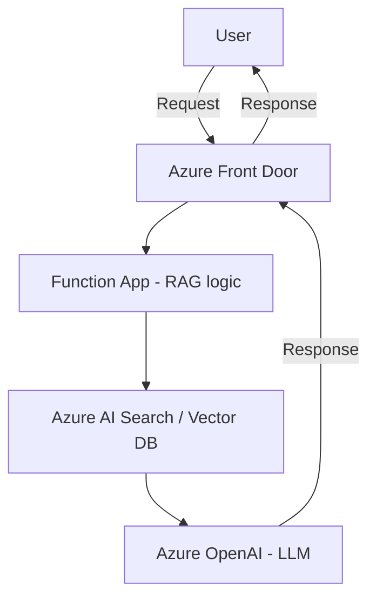

# Pricing Examples - Demonstration Purposes Only

Costa Rica

 

[brown9804](https://github.com/brown9804)

Last updated: 2025-08-18

----------

> Provides estimated reference costs for a Retrieval-Augmented Generation (RAG) solution over one month, broken down by components.

> [!NOTE]
> Use these values in the [Azure Pricing Calculator](https://azure.microsoft.com/en-us/pricing/calculator/) as a reference. While prices may be adjusted, this guide serves as a foundational resource for the procedure to be followed. Keep in mind that `costs will depend on the specific architecture you choose and your unique requirements`. This breakdown provides an overview of key components `you may require all, some, or even additional elements based on your use case.`

<b>List of References </b> (Click to expand)

- [Azure Pricing Calculator](https://azure.microsoft.com/en-us/pricing/calculator/)
- [Document Intelligence pricing](https://azure.microsoft.com/en-in/pricing/details/ai-document-intelligence/?msockid=38ec3806873362243e122ce086486339)
- [Azure AI Search pricing](https://azure.microsoft.com/en-us/pricing/details/search/?msockid=38ec3806873362243e122ce086486339)

<b>Table of Content </b> (Click to expand)

- [Document Intelligence](#document-intelligence)
- [AI Search](#ai-search)
- [Azure Open AI or AI Foundry](#azure-open-ai-or-ai-foundry)
- [Storage Account](#storage-account)
- [Cosmos DB](#cosmos-db)
- [Key Vault](#key-vault)
- [Virtual Machine](#virtual-machine)
- [App Service](#app-service)
- [Function App](#function-app)
- [Network](#network)
- [AI Services](#ai-services)
- [Front Door](#front-door)

## Document Intelligence

> `Azure AI Document Intelligence is a cloud-based AI service (SaaS) that provides an API for document processing`. It `extracts text, tables, and key data from PDFs, images, and scanned documents using AI models.` It automates workflows, supports prebuilt and custom models, and integrates with Azure AI services. Common uses include invoice processing, contract analysis, and healthcare forms. Developers can access it via APIs or SDKs in Python, .NET, and Java.

Please click here [Demonstration: Azure AI Document Intelligence Pricing](./0_Doc-Intellig.md) to get more information. 

## AI Search

> Azure AI Search is a `cloud-based search-as-a-service` from Microsoft that enables developers to build `intelligent, scalable search experiences` into web, mobile, and enterprise applications. It combines `full-text search` with `AI-powered capabilities` like `semantic ranking`, `natural language processing`, and `cognitive skills` for content enrichment. With `built-in scalability`, `enterprise-grade security`, and `global availability`, helps users `quickly find relevant information` across large datasets, ideal for use cases like `e-commerce`, `knowledge management`, and `digital content discovery`.

Please click here [Demonstration: Azure AI Search Pricing](./1_AI-Search.md) to get more information. 

## Azure Open AI or AI Foundry

> **Azure Open AI** is a cloud-based generative AI service `that exclusively provides OpenAI models` (e.g., GPT‑3.5 and GPT‑4) for natural language processing, text generation, and semantic understanding.   
> **Azure AI Foundry** `supports every type of AI model, allowing developers to deploy and manage a wide range of models` (from OpenAI’s to other machine learning architectures) for diverse intelligent applications.

Please click here [Demonstration: Azure Open AI & AI Foundry Pricing](./2_AOAI-AIFoundry.md) to get more information. 

## Storage Account  

> Azure Storage Account is a cloud-based Infrastructure-as-a-Service `(IaaS)` offering from Microsoft that provides `highly available, durable, and scalable storage` for a wide range of data types. It supports `blobs`, `files`, `queues`, `tables`, and `disks`, making it ideal for `structured and unstructured data`. With features like `geo-redundancy`, `encryption at rest`, and `fine-grained access control`, it ensures `secure and resilient data storage`. Azure Storage integrates seamlessly with `Azure services`, `DevOps pipelines`, and `data analytics tools`, making it a core component for `cloud-native applications`, `backup and disaster recovery`, and `big data workloads`.

## Cosmos DB 

> Azure Cosmos DB is a cloud-based Platform-as-a-Service `(PaaS)` offering from Microsoft that delivers a `globally distributed, multi-model NoSQL database` designed for `high availability`, `low latency`, and `elastic scalability`. It supports multiple data models including `document`, `key-value`, `graph`, and `column-family`, and offers APIs for `SQL`, `MongoDB`, `Cassandra`, `Gremlin`, and `Table`. With features like `automatic indexing`, `multi-region writes`, and `99.999% availability SLA`, Cosmos DB is ideal for `real-time applications`, `IoT`, `personalization engines`, and `mission-critical workloads` that demand `instant responsiveness` and `global reach`.

## Key Vault 

> Azure Key Vault is a cloud-based Platform-as-a-Service `(PaaS)` offering from Microsoft that provides a `secure and centralized solution` for managing `secrets`, `encryption keys`, and `certificates`. It enables developers and IT teams to `safeguard cryptographic keys and secrets` used by cloud applications and services. With features like `hardware security module (HSM) protection`, `role-based access control`, and `audit logging`, Key Vault ensures `compliance`, `data protection`, and `access governance`. It integrates seamlessly with `Azure services`, `DevOps pipelines`, and `identity management systems`, making it ideal for `secure application development`, `key lifecycle management`, and `regulatory compliance`.

## Virtual Machine 

> Azure Virtual Machine is a cloud-based Infrastructure-as-a-Service `(IaaS)` offering from Microsoft that provides `on-demand, scalable computing resources` in the cloud. It allows users to `deploy and manage virtualized Windows or Linux servers`, giving full control over the operating system, storage, and installed software. With features like `custom VM sizes`, `automated scaling`, `availability sets`, and `integration with Azure networking`, it supports a wide range of workloads from `development and testing` to `enterprise-grade applications`. Azure VMs offer `high availability`, `disaster recovery options`, and `pay-as-you-go pricing`, making them ideal for `lift-and-shift migrations`, `legacy app hosting`, and `customized compute environments`.

## App Service 

> Azure App Service is a cloud-based Platform-as-a-Service `(PaaS)` offering from Microsoft that enables developers to `build, host, and scale web applications and APIs` quickly and efficiently. It supports multiple languages like `.NET`, `Java`, `Node.js`, `Python`, and `PHP`, and provides built-in capabilities like `auto-scaling`, `custom domains`, `SSL certificates`, and `CI/CD integration`. App Service includes two key components:  
>
> - **Web App**: for hosting `websites`, `RESTful APIs`, and `backend services` with full support for `custom code`, `frameworks`, and `containers`.  
> - **Function App**: for running `event-driven serverless functions` that scale automatically and are ideal for `background tasks`, `data processing`, and `microservices`.  

## Function App

> **Azure Function App** is a cloud-based Platform-as-a-Service `(PaaS)` offering from Microsoft that enables developers to run `event-driven, serverless code` without managing infrastructure. It allows you to execute `small, modular functions` in response to triggers like `HTTP requests`, `timers`, `queue messages`, or `blob storage events`. With features like `automatic scaling`, `pay-per-execution pricing`, and `deep integration with Azure services`, Function Apps are ideal for `background tasks`, `data processing`, and `microservice architectures`.

> In **Retrieval-Augmented Generation (RAG)** solutions, Azure Function Apps play a key role in handling `orchestration logic`, such as `query preprocessing`, `calling vector databases`, `invoking AI models`, or `post-processing responses`. They enable a `lightweight, scalable backend` that connects components like `Azure Cognitive Search`, `Azure OpenAI`, and `Azure Cosmos DB`, making Function Apps a powerful tool for building `modular, intelligent, and cost-efficient RAG pipelines`.

## Network 

> Key Azure networking components commonly used in a **Retrieval-Augmented Generation (RAG)** architecture, and how they contribute to **security**, **performance**, and **connectivity**:

1. **Virtual Network (VNet)**: is a private, isolated network in Azure that allows resources like VMs, Azure Functions, and databases to securely communicate with each other. In a RAG solution, it ensures that components like **Azure OpenAI**, **Cognitive Search**, and **Cosmos DB** are connected securely and efficiently.
2. **Subnet**: is a segment within a VNet that helps organize and isolate resources. For example, you might place **Function Apps** in one subnet and **vector databases** in another to apply different security rules or routing policies.
3. **Private Endpoint (PE)**: allows you to connect securely to Azure services (like **Azure OpenAI**, **Cognitive Search**, or **Blob Storage**) over a private IP address within your VNet. This avoids exposure to the public internet, which is critical for **data privacy** in RAG pipelines.
4. **Network Security Group (NSG)**: acts as a virtual firewall that controls inbound and outbound traffic to Azure resources. In a RAG setup, NSGs help enforce strict access rules between components like **Function Apps**, **APIs**, and **databases**.
5. **Azure DDoS Protection**: provides automatic detection and mitigation of Distributed Denial of Service (DDoS) attacks. It helps protect public-facing endpoints in a RAG solution, such as APIs or web apps, ensuring availability under attack.
6. **VNet Integration**: allows services like **Azure App Service** or **Function Apps** to securely access resources inside a VNet. This is essential for connecting to private endpoints or internal databases in a RAG pipeline.
7. **Service Endpoints**: extend your VNet to Azure services over the Azure backbone network. While not as secure as Private Endpoints, they are simpler to configure and still avoid public internet exposure.
8. **Application Gateway with WAF** *(optional)*: provides Layer 7 load balancing and includes a Web Application Firewall (WAF) to protect against common web vulnerabilities. Useful for exposing RAG APIs securely to external users.
9. **Azure Firewall** *(optional)*: is a managed, cloud-based network security service that protects Azure Virtual Network resources. It provides centralized control and logging for traffic flowing in and out of your RAG environment.

## AI Services 

1. **Azure AI Prompt Flow**: A low-code tool in Azure AI Studio that helps you design, evaluate, and optimize prompt engineering workflows. It’s useful for orchestrating RAG pipelines, chaining together retrieval, grounding, and generation steps.
2. **Azure Cognitive Services – Language**: Offers capabilities like **entity recognition**, **key phrase extraction**, and **text summarization**, which can be used to preprocess or enrich documents before feeding them into a RAG pipeline.
3. **Azure Cognitive Services – Translator**: Enables multilingual RAG solutions by translating user queries or retrieved documents into the desired language before passing them to the LLM.
4. **Azure AI Content Safety**: Helps detect and filter harmful or inappropriate content in both retrieved documents and generated responses, ensuring responsible AI use in RAG applications.
5. **Azure AI Custom Neural Voice & Speech Services** *(for voice-based RAG)*: Useful if your RAG solution includes voice input/output, enabling transcription, synthesis, and voice interaction.
6. **Azure Machine Learning**: Can be used to train or fine-tune custom models, manage vector embeddings, or evaluate RAG performance using custom metrics and pipelines.

## Front Door 

> **Azure Front Door** is a `cloud-native global application delivery network` and a `Platform-as-a-Service (PaaS)` offering from Microsoft that provides `high-performance, secure, and scalable entry points` for your web applications and APIs. **Support SaaS applications and APIs** by acting as a secure, intelligent gateway that improves **performance**, **availability**, and **protection** for cloud-based services—including those used in **RAG (Retrieval-Augmented Generation)** solutions. It offers features like:  
>
> - Global HTTP/HTTPS load balancing  
> - SSL offloading  
> - Web Application Firewall (WAF)  
> - URL-based routing  
> - Caching and acceleration via edge POPs  

> [!IMPORTANT]
> The information provided and any document (such as scripts, sample codes, etc.) is provided `AS-IS` and `WITH ALL FAULTS`. Pricing estimates are for `demonstration purposes only and do not reflect final pricing`. `Microsoft assumes no liability` for your use of this information and makes no guarantees or warranties, expressed or implied, regarding its accuracy or completeness, including any pricing details. `Please note that these demos are intended as a guide and are based on my personal experiences. For official guidance, support, or more detailed information, please refer to Microsoft's official documentation or contact Microsoft directly`: [Microsoft Sales and Support](https://support.microsoft.com/contactus?ContactUsExperienceEntryPointAssetId=S.HP.SMC-HOME)

<!-- START BADGE -->

  
  
Refresh Date: 2025-09-09

<!-- END BADGE -->
