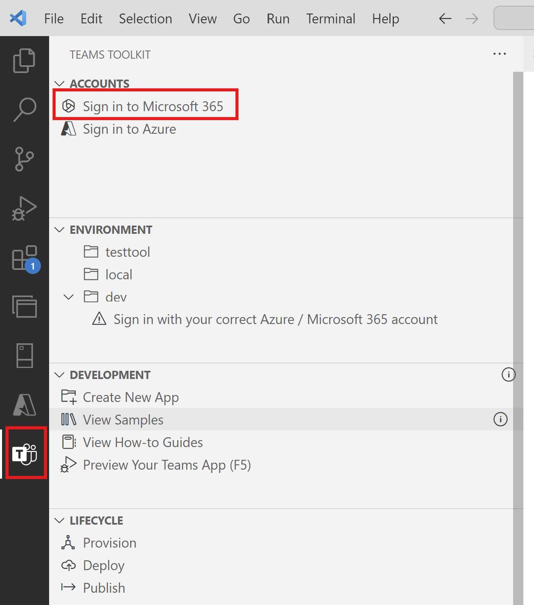
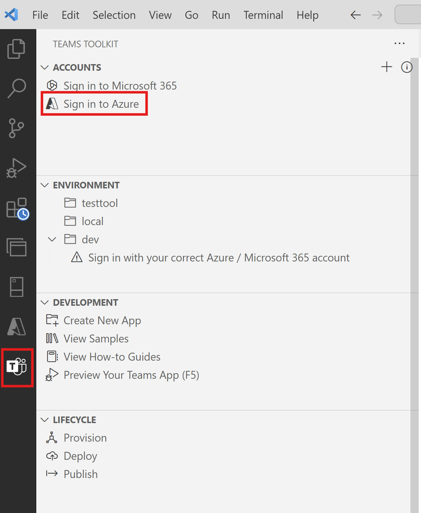
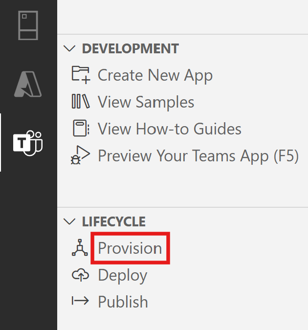
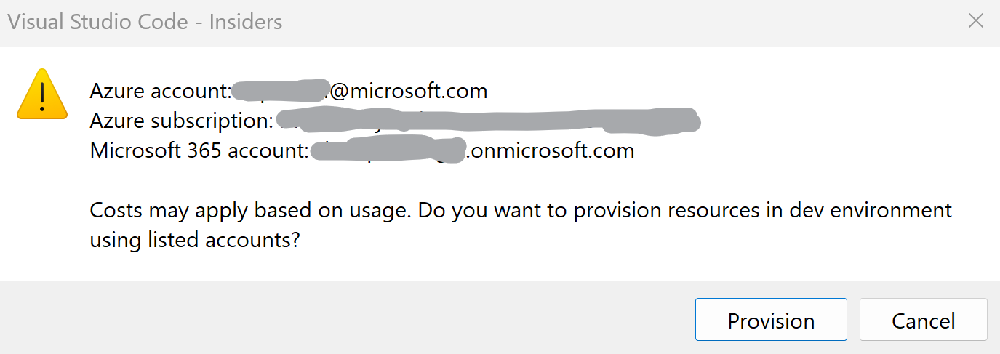
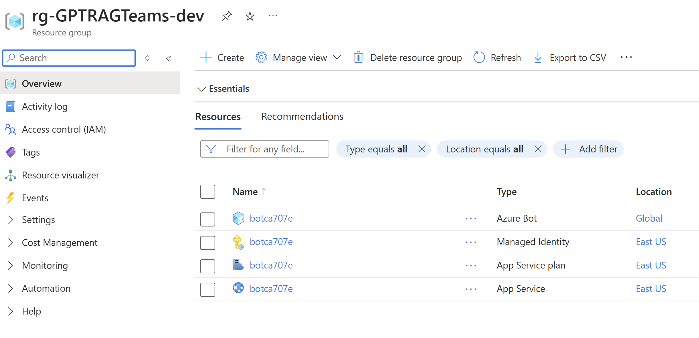
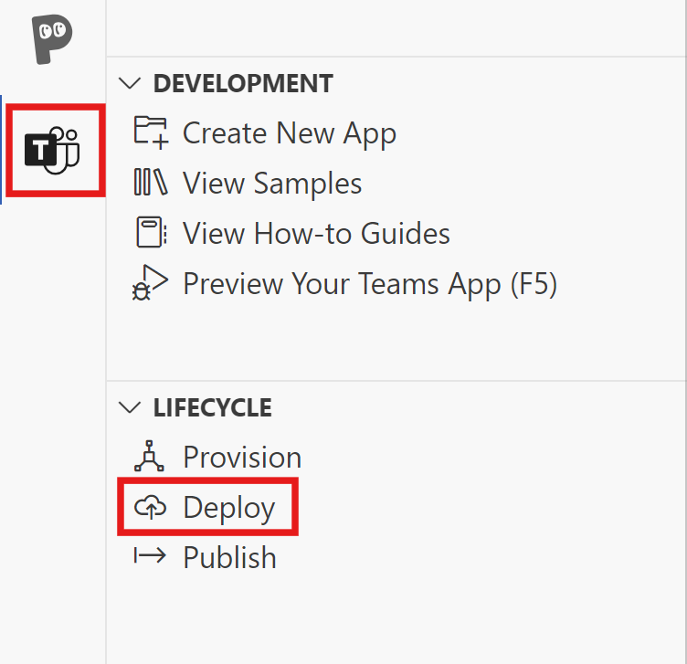

# Guide for Building a Teams App Interface for Enterprise GPT-RAG Solution Accelerator

*Ensure all steps mentioned in [Step 2](TEAMS_INTEGRATION_STEP2.md) are completed before proceeding with the steps below.*

- Note: When deploying Azure resources for the Teams app, such as the App Service Plan and App Service, you can utilize the resources already provisioned in the GPT-RAG Solution Accelerator.

## Step 3: Provision and Deploy the Azure resources for the Teams App
1. Select the **Teams Toolkit** icon in the sidebar. Select **Sign in to Microsoft 365**. 

2. Your default web browser opens to let you sign in to the account. Sign in with Microsoft 365 account. Close the browser when prompted and return to Visual Studio Code.

3. Select the **Teams Toolkit** icon in the sidebar. Select **Sign in to Azure**. 

4. Your default web browser opens to let you sign in to the account. Sign in to your Azure account. Close the browser when prompted and return to Visual Studio Code.

5. Select Provision from the LIFECYCLE section in the left pane.

6. Select the Azure subscription. 

7. Select an existing resource group or create a new resource group. Press **Enter**.

8. Select the Azure location.

9. Review the message and select **Provision**.

10. Wait for the provisioning process to complete. 

11. You can review the deployed Azure resources on the Azure portal.

12. Select Deploy from the LIFECYCLE section in the left pane.

13. Select Deploy.

13. Wait for the deployment to complete.

Proceed to Step 4: [Build the Teams App](TEAMS_INTEGRATION_STEP4.md).

## Additional Resources
- [Step 2: Connect to GPT-RAG Orchestrator and test locally](TEAMS_INTEGRATION_STEP2.md).
- [Step 4: Build the Teams App](TEAMS_INTEGRATION_STEP4.md).

## External Resources
- [Provision cloud resources](https://learn.microsoft.com/en-us/microsoftteams/platform/toolkit/provision).
- [Deploy Microsoft Teams app to the cloud](https://learn.microsoft.com/en-us/microsoftteams/platform/toolkit/deploy).

Last updated: 2025-04-02
