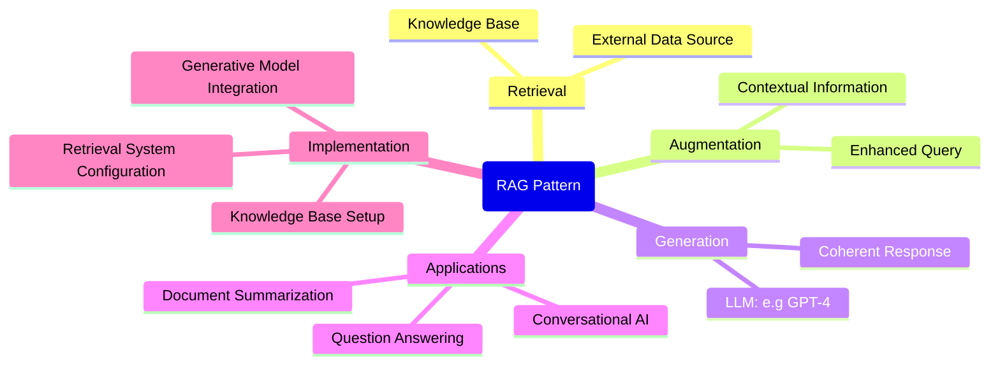

# RAG ChatBot - Basic Architecture 

> Retrieval-Augmented Generation (RAG)

Costa Rica

[brown9804](https://github.com/brown9804)

Last updated: 2025-03-20

----------

> [!IMPORTANT]
> Disclaimer: This repository contains example of a Retrieval-Augmented Generation (RAG) chat bot with a basic architecture designed for scenarios without network isolation. This is `just a guide `. It is not an official solution guide. For official guidance, support, or more detailed information. Please refer [RAG with Zero-Trust – Architecture Referenceto Microsoft's official documentation](https://github.com/Azure/GPT-RAG) or contact Microsoft directly: [Microsoft Sales and Support](https://support.microsoft.com/contactus?ContactUsExperienceEntryPointAssetId=S.HP.SMC-HOME)

> [!NOTE]
> This approach focuses on `setting up the required infrastructure via Terraform`. It allows for source control of not only the solution code, connections, and setups `but also the infrastructure itself`.

## Prerequisites

- An `Azure subscription is required`. All other resources, including instructions for creating a Resource Group, are provided.
-` Contributor role assigned or any custom role that allows`: access to manage all resources, and the ability to deploy resources within subscription.
- If you choose to use the Terraform approach, please ensure that:
  -  [Terraform is installed on your local machine](https://developer.hashicorp.com/terraform/tutorials/azure-get-started/install-cli#install-terraform).
  -  [Install the Azure CLI](https://learn.microsoft.com/en-us/cli/azure/install-azure-cli) to work with both Terraform and Azure commands.

## Where to start? 

1. Please follow the [Terraform guide](./terraform-infrastructure/README.md) to deploy the necessary Azure resources for the solution.

      

        
      

2. Then, follow each [section](#content) to complete the implementation.

## Content 

- [RAG Overview](./instructions/0_RAG_Overview.md): Quick overview, explaining how it works, its applications, and how to implement it using Azure AI services.
- [Implementation Overview](./instructions/2_Implementation_Overview.md): Quick overview of the implementation steps required to configure the RAG solution using Azure AI services, including setting up Azure AI Search, deploying Azure OpenAI Service, configuring Azure Function App, Storage Account, securing with Azure Key Vault, setting up Azure Cosmos DB, etc.

## Zero Trust 

> Zero Trust AI architecture in Microsoft Azure is a `security framework designed to protect data, applications, and infrastructure by assuming that threats can come from both inside and outside the network`. This model operates on the principle of "never trust, always verify", meaning `every access request is thoroughly authenticated and authorized based on all available data points, regardless of its origin. The architecture integrates multiple layers of security, including strong identity verification, device compliance checks, and least privilege access, ensuring that only authorized users and devices can access sensitive resources`. By continuously monitoring and validating each request, Zero Trust AI architecture helps organizations minimize risks and enhance their overall security posture

> [!IMPORTANT]
> Click [here for a more quick guidance about Zero Trust](./instructions/1_ZeroTrustRAG). For a `solution accelerator with a zero-trust architecture` please refer to [Microsoft's official GPT-RAG Solution Accelerator](https://github.com/Azure/GPT-RAG) or contact Microsoft directly: [Microsoft Sales and Support](https://support.microsoft.com/contactus?ContactUsExperienceEntryPointAssetId=S.HP.SMC-HOME)

## Important Considerations for Production Environment

- **Public Network Site**: This example is based on a public network site and is intended for demonstration purposes only. It showcases how several Azure resources can work together to achieve the desired result.
- **Private Network Configuration**: For enhanced security, consider configuring your Azure resources to operate within a private network. This can be achieved using Azure Virtual Network (VNet) to isolate your resources and control inbound and outbound traffic. Implementing private endpoints for services like Azure Blob Storage and Azure Functions can further secure your data by restricting access to your VNet.
- **Security**: Ensure that you implement appropriate security measures when deploying this solution in a production environment. This includes:
  - **Securing Access**: Use Azure Entra ID (formerly known as Azure Active Directory or Azure AD) for authentication and role-based access control (RBAC) to manage permissions.
  - **Managing Secrets**: Store sensitive information such as connection strings and API keys in Azure Key Vault.
  - **Data Encryption**: Enable encryption for data at rest and in transit to protect sensitive information.
- **Scalability**: While this example provides a basic setup, you may need to scale the resources based on your specific requirements. Azure services offer various scaling options to handle increased workloads. Consider using:
  - **Auto-scaling**: Configure auto-scaling for Azure Functions and other services to automatically adjust based on demand.
  - **Load Balancing**: Use Azure Load Balancer or Application Gateway to distribute traffic and ensure high availability.
- **Cost Management**: Monitor and manage the costs associated with your Azure resources. Use Azure Cost Management and Billing to track usage and optimize resource allocation.
- **Compliance**: Ensure that your deployment complies with relevant regulations and standards. Use Azure Policy to enforce compliance and governance policies across your resources.
- **Disaster Recovery**: Implement a disaster recovery plan to ensure business continuity in case of failures. Use Azure Site Recovery and backup solutions to protect your data and applications.

  <h3 style="color: #4CAF50;">Total Visitors</h3>
  

