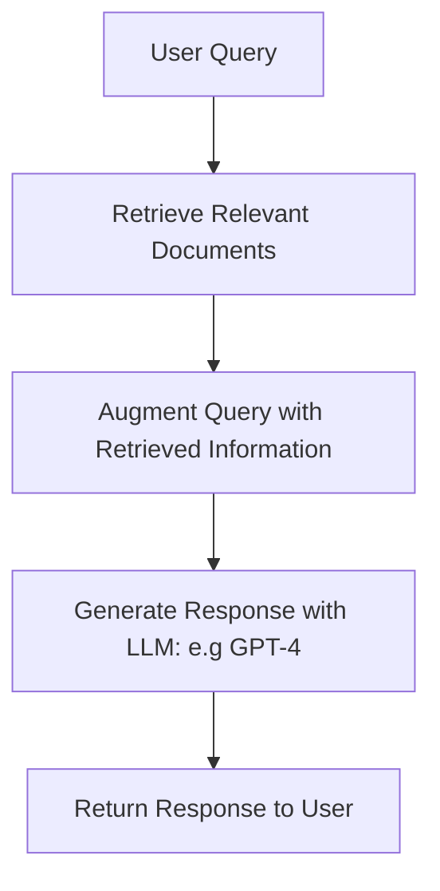

#  RAG Chatbot Implementation - Overview 

Costa Rica

 

[brown9804](https://github.com/brown9804)

Last updated: 2025-03-20

----------

## Overview 

  <h3 style="color: #4CAF50;">Total Visitors</h3>
  

